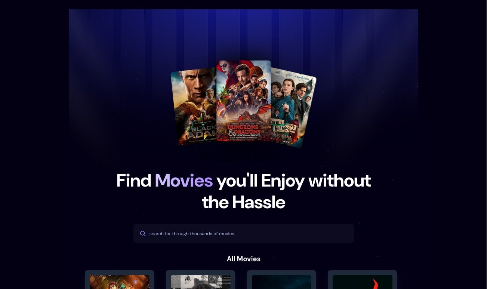
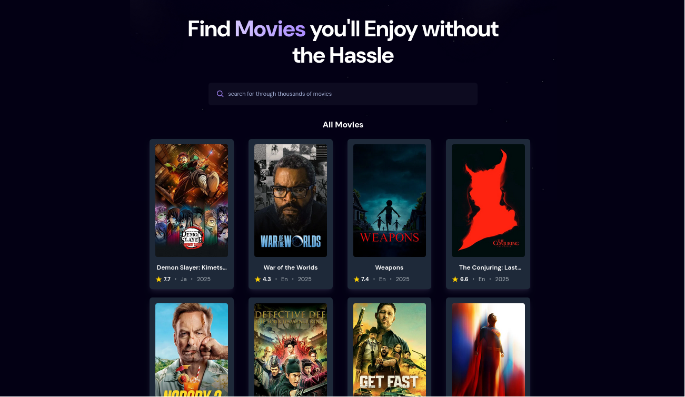

# Movie App 🎬

A full-stack **React** movie application that allows users to **search for movies** and **view trending movies**. The app integrates **TMDB API** for movie data and **Appwrite** for storing search counts and tracking trending movies.  

  
  

---

## Features

- Search movies using **TMDB API**.  
- View **trending movies** based on search popularity.  
- Store and update **search counts** in Appwrite database.  
- Responsive UI built with **React**, **Tailwind CSS**.  
- Debounced search input for optimized API calls.  

---

## Screenshots

1. Search movies and view results.  
2. Trending movies section showing top searched movies.  

---

## Tech Stack

- **Frontend:** React, Tailwind CSS  
- **Backend / Database:** Appwrite  
- **API:** TMDB (The Movie Database)  
- **Deployment:** Vite  

---

## Getting Started

### 1. Clone the repository

```bash
git clone https://github.com/your-username/movie-app.git
cd movie-app

2. Install dependencies

npm install

3. Create .env file

Add the following environment variables in a .env file at the project root:

VITE_TMDB_API_KEY=YOUR_TMDB_API_KEY
VITE_APPWRITE_PROJECT_ID=YOUR_APPWRITE_PROJECT_ID
VITE_APPWRITE_DATABASE_ID=YOUR_APPWRITE_DATABASE_ID
VITE_APPWRITE_COLLECTION_ID=YOUR_APPWRITE_COLLECTION_ID
VITE_APPWRITE_ENDPOINT=https://YOUR_APPWRITE_ENDPOINT/v1

    Replace each value with your own keys and IDs.

4. Start the development server

npm run dev

Visit http://localhost:5173 (or the URL shown in your terminal) to see the app in action.
Folder Structure

├── src/
│   ├── components/   # React components (Search, MovieCard, Spinner)
│   ├── App.jsx       # Main app
│   ├── appwrite.js   # Appwrite integration
│   ├── App.css       # Styles
├── public/
│   └── hero-img.png  # Banner image
├── screenshots/
│   ├── 1.png
│   └── 2.png
├── .env
├── package.json
└── README.md

Usage

    Search: Type a movie name in the search bar and press Enter.

    Trending: See the top 5 trending movies based on search popularity.

Contributing

    Fork the repository

    Create your feature branch (git checkout -b feature/FeatureName)

    Commit your changes (git commit -m "Add some feature")

    Push to the branch (git push origin feature/FeatureName)

    Create a Pull Request

License

This project is licensed under the MIT License.
Acknowledgements

    TMDB API

for movie data

Appwrite

for backend and database

React
and Tailwind CSS

    for frontend
